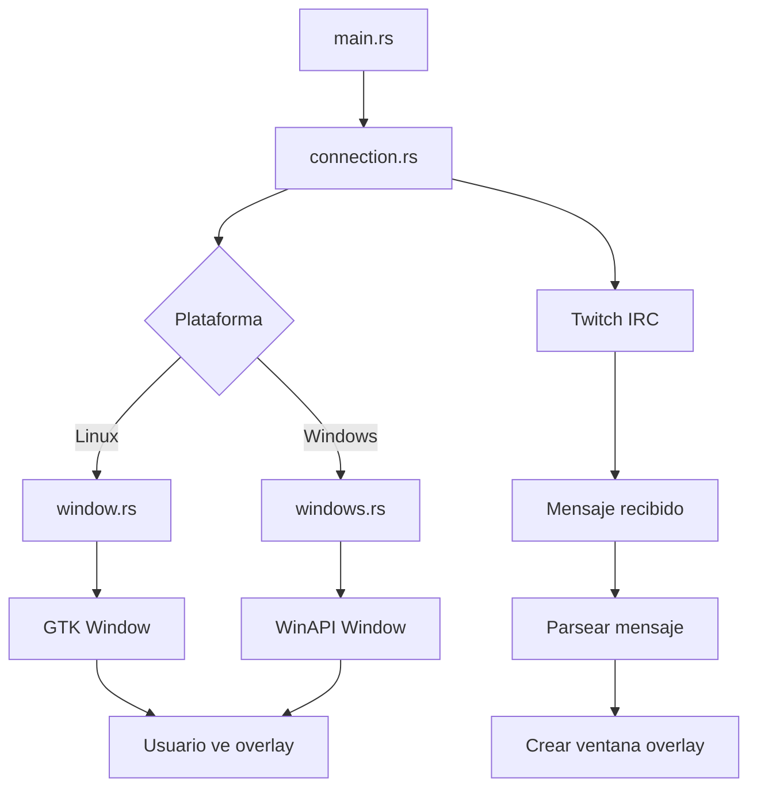
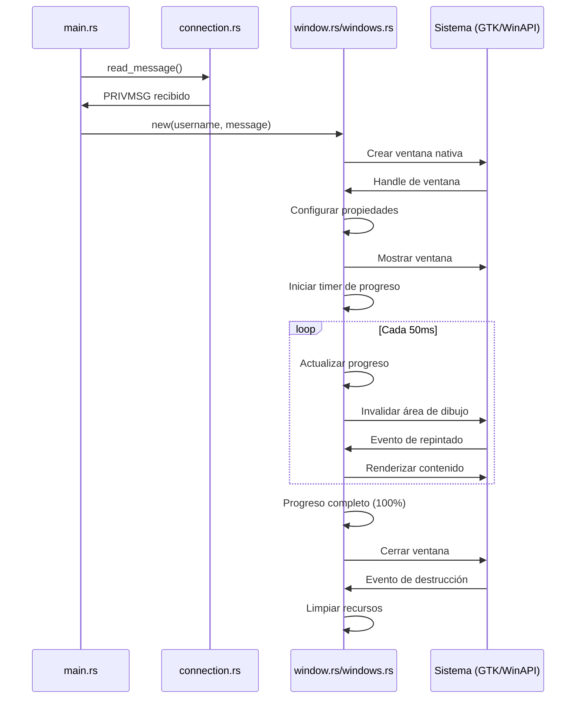

# Arquitectura del Código

## 🏗️ Visión General

Overlay Native es una aplicación multiplataforma que implementa un cliente IRC para Twitch con capacidades de overlay visual. La arquitectura está diseñada con separación clara entre la lógica de negocio y las implementaciones específicas de cada plataforma.

## 📁 Estructura del Proyecto

```
overlay-native/
├── src/
│   ├── main.rs          # Punto de entrada y coordinación principal
│   ├── connection.rs    # Cliente IRC de Twitch y manejo de mensajes
│   ├── window.rs        # Implementación GTK para Linux
│   ├── windows.rs       # Implementación WinAPI para Windows
│   └── x11.rs          # Utilidades específicas de X11 (Linux)
├── docs/
│   ├── ARCHITECTURE.md  # Este archivo
│   ├── INSTALLATION.md  # Guía de instalación
│   ├── LINUX_SPECS.md   # Especificaciones Linux
│   └── WINDOWS_SPECS.md # Especificaciones Windows
├── Cargo.toml          # Configuración del proyecto Rust
└── README.md           # Documentación principal
```

## 🔄 Flujo de Datos



## 📋 Módulos Principales

### 1. main.rs - Coordinador Principal

**Responsabilidades:**
- Inicialización de la aplicación
- Configuración del cliente IRC
- Manejo del bucle principal de eventos
- Coordinación entre módulos

**Componentes clave:**
```rust
#[tokio::main]
async fn main() {
    // 1. Configuración inicial
    // 2. Creación del cliente IRC
    // 3. Conexión a Twitch
    // 4. Bucle de manejo de mensajes
}
```

**Flujo de ejecución:**
1. Inicializar logging y configuración
2. Crear cliente IRC con credenciales
3. Conectar al servidor de Twitch
4. Unirse al canal especificado
5. Escuchar mensajes en bucle infinito
6. Delegar creación de ventanas según plataforma

### 2. connection.rs - Cliente IRC

**Responsabilidades:**
- Manejo de la conexión TCP con Twitch
- Implementación del protocolo IRC
- Parsing de mensajes PRIVMSG
- Autenticación y manejo de estado

**Estructura principal:**
```rust
pub struct TwitchClient {
    stream: TcpStream,
    reader: BufReader<ReadHalf<TcpStream>>,
    writer: WriteHalf<TcpStream>,
}

impl TwitchClient {
    pub async fn connect() -> Result<Self>
    pub async fn authenticate(&mut self, nick: &str, pass: &str) -> Result<()>
    pub async fn join(&mut self, channel: String) -> Result<()>
    pub async fn read_message(&mut self) -> Result<Option<String>>
}
```

**Protocolo IRC implementado:**
- `PASS` - Autenticación con token OAuth
- `NICK` - Establecer nickname
- `JOIN` - Unirse a canal
- `PRIVMSG` - Recibir mensajes de chat
- `PING/PONG` - Mantener conexión viva

### 3. window.rs - Implementación Linux (GTK)

**Responsabilidades:**
- Crear ventanas overlay usando GTK
- Renderizado con Cairo
- Manejo de transparencia con composición
- Gestión del ciclo de vida de ventanas

**Arquitectura de ventana:**
```rust
pub struct LinuxWindow {
    window: gtk::Window,
    drawing_area: gtk::DrawingArea,
    progress: Arc<Mutex<f64>>,
    username: String,
    message: String,
    created_time: Instant,
}

impl WindowTrait for LinuxWindow {
    fn new(username: String, message: String) -> Self
    fn show(&self)
    fn set_progress(&self, progress: f64)
    fn close(&self)
}
```

**Stack tecnológico:**
- **GTK 3.0+**: Framework de ventanas
- **GDK**: Gestión de display y eventos
- **Cairo**: Renderizado 2D
- **Pango**: Renderizado de texto
- **X11**: Funcionalidades específicas del sistema

### 4. windows.rs - Implementación Windows (WinAPI)

**Responsabilidades:**
- Crear ventanas overlay usando WinAPI nativo
- Renderizado con GDI
- Manejo de transparencia con Layered Windows
- Gestión de memoria y recursos Win32

**Arquitectura de ventana:**
```rust
pub struct WindowsWindow {
    hwnd: HWND,
    progress: f64,
    username: String,
    message: String,
}

#[repr(C)]
struct WindowData {
    progress: f64,
    created_time: Instant,
}

impl WindowTrait for WindowsWindow {
    fn new(username: String, message: String) -> Self
    fn show(&self)
    fn set_progress(&self, progress: f64)
    fn close(&self)
}
```

**APIs utilizadas:**
- **User32**: Creación y manejo de ventanas
- **GDI32**: Renderizado y dibujo
- **Kernel32**: Gestión de memoria y procesos
- **Layered Windows**: Transparencia y efectos

### 5. x11.rs - Utilidades X11 (Linux)

**Responsabilidades:**
- Funcionalidades específicas de X11
- Información de pantalla y displays
- Utilidades de bajo nivel para ventanas

## 🎯 Patrones de Diseño

### 1. Trait Pattern para Abstracción de Plataforma

```rust
pub trait WindowTrait {
    fn new(username: String, message: String) -> Self;
    fn show(&self);
    fn set_progress(&self, progress: f64);
    fn close(&self);
}

// Implementaciones específicas
impl WindowTrait for LinuxWindow { /* ... */ }
impl WindowTrait for WindowsWindow { /* ... */ }
```

**Beneficios:**
- Interfaz uniforme entre plataformas
- Facilita testing y mantenimiento
- Permite extensión a nuevas plataformas

### 2. RAII (Resource Acquisition Is Initialization)

```rust
// Linux - GTK maneja automáticamente
impl Drop for LinuxWindow {
    fn drop(&mut self) {
        // GTK limpia automáticamente
    }
}

// Windows - limpieza manual necesaria
impl Drop for WindowsWindow {
    fn drop(&mut self) {
        unsafe {
            if !self.hwnd.is_null() {
                DestroyWindow(self.hwnd);
            }
        }
    }
}
```

### 3. Factory Pattern para Creación de Ventanas

```rust
pub fn create_window(username: String, message: String) -> Box<dyn WindowTrait> {
    #[cfg(target_os = "linux")]
    return Box::new(LinuxWindow::new(username, message));
    
    #[cfg(target_os = "windows")]
    return Box::new(WindowsWindow::new(username, message));
}
```

### 4. Observer Pattern para Actualizaciones

```rust
// Progreso se actualiza via callbacks/timers
// Linux: GLib::timeout_add
// Windows: SetTimer + WM_TIMER
```

## 🔄 Ciclo de Vida de Ventanas

### Secuencia de Creación



### Estados de Ventana

1. **Creación**: Inicialización de estructuras
2. **Configuración**: Establecer propiedades (tamaño, posición, transparencia)
3. **Mostrar**: Hacer visible la ventana
4. **Activa**: Renderizado y actualizaciones de progreso
5. **Cierre**: Limpieza de recursos y destrucción

## 🧵 Concurrencia y Threading

### Modelo de Threading

```rust
// main.rs - Thread principal
#[tokio::main]
async fn main() {
    // Manejo asíncrono de red con Tokio
    let mut client = TwitchClient::connect().await?;
    
    loop {
        if let Some(message) = client.read_message().await? {
            // Crear ventana en thread principal (requerido por GUI)
            create_window_for_message(message);
        }
    }
}

// Ventanas - Thread principal (GUI thread)
// Linux: GTK requiere thread principal
// Windows: Mejor rendimiento en thread principal
```

### Sincronización

```rust
// Progreso compartido entre timer y ventana
use std::sync::{Arc, Mutex};

struct WindowState {
    progress: Arc<Mutex<f64>>,
    should_close: Arc<Mutex<bool>>,
}
```

## 🎨 Sistema de Renderizado

### Abstracción de Renderizado

```rust
trait Renderer {
    fn clear_background(&self, color: Color);
    fn draw_text(&self, text: &str, x: i32, y: i32, font: &Font);
    fn draw_progress_bar(&self, rect: Rect, progress: f64);
    fn present(&self);
}

// Implementaciones específicas
struct CairoRenderer { /* Cairo context */ }
struct GDIRenderer { /* Windows HDC */ }
```

### Pipeline de Renderizado

1. **Clear**: Limpiar fondo con color base
2. **Background**: Dibujar fondo semi-transparente
3. **Text**: Renderizar username (bold) y mensaje
4. **Progress**: Dibujar barra de progreso
5. **Present**: Mostrar frame completo

## 🔧 Configuración y Extensibilidad

### Configuración Actual (Hardcoded)

```rust
// En main.rs
const TWITCH_SERVER: &str = "irc.chat.twitch.tv:6667";
const CHANNEL: &str = "#tu_canal";
const WINDOW_DURATION: Duration = Duration::from_secs(10);
const UPDATE_INTERVAL: Duration = Duration::from_millis(50);
```

### Extensibilidad Futura

```rust
// Configuración por archivo
#[derive(Deserialize)]
struct Config {
    twitch: TwitchConfig,
    window: WindowConfig,
    appearance: AppearanceConfig,
}

// Plugin system
trait MessageProcessor {
    fn process_message(&self, message: &str) -> ProcessedMessage;
}

// Emote rendering
trait EmoteRenderer {
    fn render_emote(&self, emote_id: &str, x: i32, y: i32);
}
```

## 📊 Gestión de Memoria

### Linux (GTK)
- **Automática**: GTK maneja reference counting
- **Signals**: Desconexión automática al destruir
- **Cairo**: Contexts se liberan automáticamente

### Windows (WinAPI)
- **Manual**: Liberación explícita de recursos
- **GDI Objects**: DeleteObject() requerido
- **Window Data**: Box::from_raw() para cleanup

```rust
// Patrón RAII para Windows
struct GDIObject(HGDIOBJ);

impl Drop for GDIObject {
    fn drop(&mut self) {
        unsafe { DeleteObject(self.0); }
    }
}
```

## 🔍 Debugging y Logging

### Sistema de Logging

```rust
use log::{info, warn, error, debug};

// Niveles de log por módulo
info!("Conectando a Twitch IRC...");
debug!("Mensaje recibido: {}", raw_message);
warn!("Ventana no pudo crearse, reintentando...");
error!("Error fatal de conexión: {}", e);
```

### Herramientas de Debug

- **Linux**: GTK Inspector, Valgrind, GDB
- **Windows**: Spy++, Application Verifier, Visual Studio Debugger
- **Cross-platform**: Rust debugging con LLDB/GDB

## 🚀 Optimizaciones

### Rendimiento

1. **Lazy Loading**: Crear ventanas solo cuando sea necesario
2. **Object Pooling**: Reutilizar recursos GDI/Cairo
3. **Dirty Rectangles**: Solo repintar áreas que cambiaron
4. **Timer Coalescing**: Agrupar actualizaciones

### Memoria

1. **RAII**: Liberación automática de recursos
2. **Weak References**: Evitar ciclos de referencia
3. **String Interning**: Reutilizar strings comunes
4. **Batch Operations**: Agrupar operaciones costosas

## 📈 Métricas y Monitoreo

### Métricas Clave

```rust
struct Metrics {
    windows_created: AtomicU64,
    windows_active: AtomicU64,
    messages_processed: AtomicU64,
    memory_usage: AtomicU64,
    render_time_avg: AtomicU64,
}
```

### Profiling

```bash
# CPU profiling
cargo install flamegraph
cargo flamegraph

# Memory profiling
valgrind --tool=massif cargo run

# Windows profiling
# Visual Studio Performance Profiler
```

## 🔮 Roadmap de Arquitectura

### Corto Plazo
1. **Configuración externa**: Archivo TOML/JSON
2. **Emote rendering**: Soporte para emotes de Twitch
3. **Error handling**: Manejo robusto de errores

### Medio Plazo
1. **Plugin system**: Extensibilidad via plugins
2. **Themes**: Sistema de temas personalizables
3. **Multi-channel**: Soporte para múltiples canales

### Largo Plazo
1. **GUI Config**: Interfaz gráfica de configuración
2. **Web overlay**: Versión web con WebRTC
3. **Mobile support**: Soporte para Android/iOS

## 📋 Principios de Diseño

### 1. Separación de Responsabilidades
- Cada módulo tiene una responsabilidad clara
- Interfaces bien definidas entre módulos
- Bajo acoplamiento, alta cohesión

### 2. Multiplataforma por Diseño
- Abstracciones que ocultan diferencias de plataforma
- Código compartido maximizado
- Implementaciones específicas minimizadas

### 3. Rendimiento Primero
- Operaciones costosas en background
- Renderizado eficiente
- Gestión cuidadosa de memoria

### 4. Robustez
- Manejo graceful de errores
- Recovery automático cuando sea posible
- Logging detallado para debugging

### 5. Extensibilidad
- Arquitectura preparada para nuevas features
- APIs estables para extensiones
- Configuración flexible

Esta arquitectura proporciona una base sólida para el desarrollo continuo del proyecto, manteniendo la simplicidad mientras permite el crecimiento y la extensión futura.